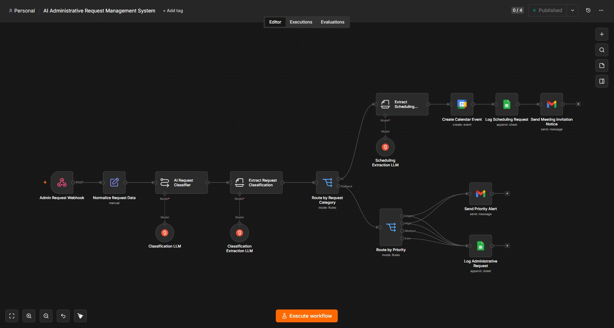
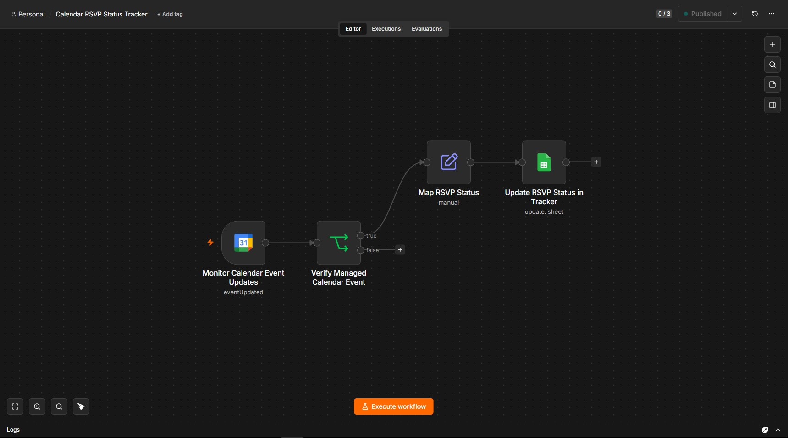
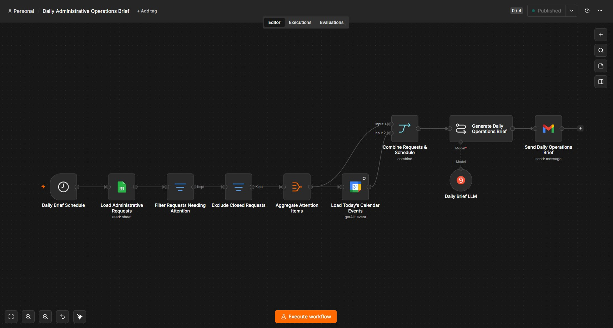
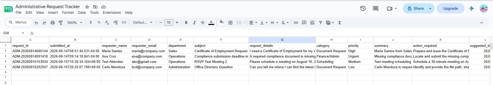
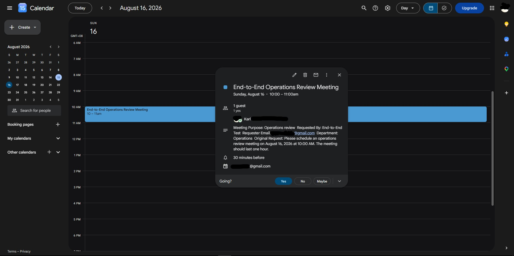
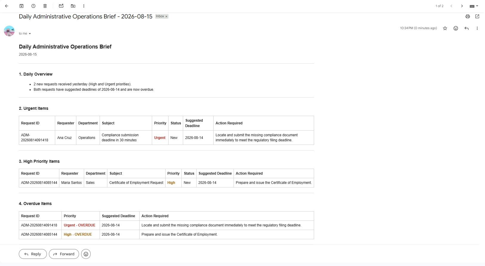

# AI Administrative Operations Automation

An end-to-end administrative operations automation system built with **n8n, Groq, Google Sheets, Google Calendar, and Gmail**.

This project automates common administrative operations tasks such as request intake, AI-powered classification, priority routing, meeting scheduling, RSVP tracking, and daily operational reporting.

The system is designed as three connected workflows that work together to reduce repetitive administrative work, improve request visibility, and provide a clearer view of operational priorities.

---

## 1. Project Overview

This project demonstrates how AI and workflow automation can be used to support day-to-day administrative operations.

Instead of manually reviewing requests, checking priorities, scheduling meetings, monitoring attendee responses, updating trackers, and preparing daily reports, the system automates those tasks across three connected n8n workflows.

At a high level, the system can:

- Receive administrative requests through a webhook
- Standardize and structure incoming request data
- Classify requests using AI
- Assign Low, Medium, High, or Urgent priority
- Route scheduling requests separately from general administrative requests
- Log requests into Google Sheets
- Send Gmail alerts for High and Urgent requests
- Create Google Calendar events automatically
- Track attendee RSVP responses
- Update meeting status in the administrative tracker
- Review active requests and meetings each day
- Generate a professional AI-powered Daily Administrative Operations Brief
- Deliver the final report automatically through Gmail

---

## 2. The Business Problem

Administrative teams often manage requests across multiple tools such as email, spreadsheets, calendars, and messaging platforms.

This can create several operational problems:

- Important requests can be missed or delayed
- Priority is often determined manually
- Scheduling requires repeated back-and-forth communication
- Meeting RSVP status may need to be checked manually
- Administrative trackers can quickly become outdated
- Daily reporting takes additional time to prepare
- Urgent or overdue work may not be immediately visible

This project addresses those problems by creating a connected automation system that receives, analyzes, routes, tracks, and reports administrative work automatically.

---

## 3. What the Automation Does

The complete system handles the administrative request lifecycle from intake to reporting.

```text
Request Submitted
      |
      v
AI Classification
      |
      v
Category & Priority Routing
      |
      +----> Administrative Request Processing
      |
      +----> Meeting Scheduling
                      |
                      v
                RSVP Tracking
                      |
                      v
               Tracker Update
                      |
                      v
             Daily Operations Brief
```

The system combines three different automation patterns:

- **Webhook-driven automation** for incoming requests
- **Event-driven automation** for Calendar RSVP updates
- **Scheduled automation** for daily operational reporting

---

## 4. How the Three Workflows Work Together

### Workflow 1 — AI Administrative Request Management System

Workflow 1 is the main intake and routing workflow.

It receives incoming administrative requests through a webhook and standardizes the data before sending it to an AI model for analysis.

The AI returns structured information including:

- Category
- Priority
- Summary
- Action required
- Suggested deadline
- Notification requirement

Supported administrative categories include:

- Document Request
- Scheduling
- Finance/Admin
- Procurement
- Customer/Client Concern
- Internal Support
- General Inquiry
- Other

Supported priority levels are:

- Low
- Medium
- High
- Urgent

The workflow does not assign urgency simply because a requester uses words such as "urgent" or "ASAP". Priority is based on the actual deadline, business impact, and consequences described in the request.

For general administrative requests, the workflow:

- Routes the request by priority
- Logs it into Google Sheets
- Sends Gmail alerts for High and Urgent requests

For scheduling requests, the workflow:

- Extracts meeting details
- Creates a Google Calendar event
- Adds the attendee
- Logs the scheduling request into Google Sheets
- Sets the initial status to `Pending Confirmation`
- Sends an automated meeting creation notification

---

### Workflow 2 — Calendar RSVP Status Tracker

Workflow 2 keeps the Administrative Request Tracker synchronized with Google Calendar.

It monitors managed Calendar events for updates.

When an attendee responds to a meeting invitation, the workflow identifies the attendee response and converts it into an internal administrative status.

| Google Calendar Response | Administrative Status |
|---|---|
| accepted | Confirmed |
| declined | Declined |
| tentative | Tentative |
| needsAction | Pending Confirmation |

The workflow uses the Calendar Event ID to locate and update the correct Google Sheets row.

This prevents duplicate records and allows the tracker to reflect the real RSVP status automatically.

Example:

```text
Meeting Created
      |
      v
Pending Confirmation
      |
      v
Attendee Clicks "Yes"
      |
      v
Google Calendar Event Updated
      |
      v
Workflow 2 Detects Update
      |
      v
accepted
      |
      v
Tracker Status = Confirmed
```

---

### Workflow 3 — Daily Administrative Operations Brief

Workflow 3 acts as the reporting layer of the system.

It runs on a daily schedule and reviews the Administrative Request Tracker for items that require attention.

The workflow identifies:

- Urgent requests
- High-priority requests
- Overdue requests
- Pending meetings
- Tentative meetings

It also excludes requests that are already closed, such as:

- Completed
- Confirmed
- Cancelled
- Declined

The workflow then reads Google Calendar for the current day's events.

Administrative request data and Calendar information are combined and passed to an AI model, which generates a structured HTML Daily Administrative Operations Brief.

The report contains:

1. Daily Overview
2. Urgent Items
3. High Priority Items
4. Overdue Items
5. Pending or Tentative Meetings
6. Today's Schedule
7. Recommended Priorities

The final report is automatically sent through Gmail.

---

## 5. End-to-End System Architecture

```text
                         ADMINISTRATIVE REQUEST
                                  |
                                  v
                  +-------------------------------+
                  |          WORKFLOW 1           |
                  | AI Request Management System  |
                  +---------------+---------------+
                                  |
                    AI Classification & Routing
                                  |
                    +-------------+-------------+
                    |                           |
                    v                           v
          General/Admin Request          Scheduling Request
                    |                           |
                    v                           v
            Route by Priority           Extract Meeting Data
                    |                           |
          +---------+---------+                 v
          |                   |          Google Calendar Event
          v                   v                 |
   Google Sheets        Gmail Alert             v
                                          Google Sheets Log
                                                 |
                                                 v
                                      Meeting Invitation Sent
                                                 |
                                                 v
                                          Attendee Responds
                                                 |
                                                 v
                  +-------------------------------+
                  |          WORKFLOW 2           |
                  | Calendar RSVP Status Tracker  |
                  +---------------+---------------+
                                  |
                                  v
                      Map Calendar RSVP Status
                                  |
                                  v
                    Update Google Sheets Record


                         DAILY SCHEDULE TRIGGER
                                  |
                                  v
                  +-------------------------------+
                  |          WORKFLOW 3           |
                  | Daily Operations Brief        |
                  +---------------+---------------+
                                  |
                 +----------------+----------------+
                 |                                 |
                 v                                 v
        Read Administrative Tracker        Read Google Calendar
                 |                                 |
                 +----------------+----------------+
                                  |
                                  v
                          AI Report Generation
                                  |
                                  v
                       HTML Operations Brief
                                  |
                                  v
                                Gmail
```

---

## 6. Workflow Screenshots

### Workflow 1 — Request Intake, AI Classification & Routing

The first workflow handles request intake, AI analysis, category routing, priority routing, Google Sheets logging, Gmail alerts, and Calendar scheduling.



---

### Workflow 2 — Calendar RSVP Monitoring & Status Synchronization

The second workflow monitors Calendar event updates and synchronizes attendee RSVP responses with the Administrative Request Tracker.



---

### Workflow 3 — Daily Operations Reporting

The third workflow reads active administrative requests and Calendar events, generates an AI-powered operations brief, and sends it through Gmail.



---

## 7. Output Examples

### Administrative Request Tracker

Google Sheets acts as the central operational tracker for the system.

The tracker stores information such as:

- Request ID
- Submission time
- Requester
- Department
- Subject
- Request details
- Category
- Priority
- Summary
- Action required
- Suggested deadline
- Status
- Meeting information
- Calendar Event ID



---

### Automated Google Calendar Scheduling

Scheduling requests are automatically converted into Google Calendar events.

The workflow extracts the meeting date, start time, end time, attendee email, title, and meeting purpose before creating the event.



---

### AI-Generated Daily Operations Brief

The final workflow produces a structured HTML administrative operations report.

Urgent, High-priority, and overdue items are clearly separated, while the report also includes meeting status, today's schedule, and recommended priorities.



---

## 8. Technology Stack

| Technology | Purpose |
|---|---|
| n8n | Workflow automation and orchestration |
| Groq | LLM inference provider |
| GPT-OSS 120B | AI classification, extraction, and report generation |
| Google Sheets | Administrative request tracking |
| Google Calendar | Meeting scheduling and RSVP monitoring |
| Gmail | Priority alerts, scheduling notifications, and daily reports |
| Webhooks | Administrative request intake |
| OAuth 2.0 | Google service authentication |

---

## 9. Repository Structure

```text
ai-administrative-operations-automation/
│
├── workflows/
│   ├── workflow-1-ai-administrative-request-management-public.json
│   ├── workflow-2-calendar-rsvp-status-tracker-public.json
│   └── workflow-3-daily-administrative-operations-brief-public.json
│
├── screenshots/
│   ├── workflow-1-ai-administrative-request-management.jpg
│   ├── workflow-2-calendar-rsvp-status-tracker.jpg
│   ├── workflow-3-daily-administrative-operations-brief.jpg
│   ├── administrative-request-tracker.jpg
│   ├── google-calendar-event.jpg
│   └── daily-operations-brief-email.jpg
│
├── docs/
│
└── README.md
```

---

## 10. How to Use the Public Workflow Templates

The `workflows/` directory contains sanitized public versions of the original n8n workflows.

These files are intended to demonstrate the workflow architecture and can also be imported into another n8n environment.

The public workflow files have been sanitized to remove deployment-specific information.

The original values for the following items are not included:

- Credential references
- Personal Gmail addresses
- Google Sheet IDs
- Google Calendar IDs
- Webhook IDs
- Workflow IDs
- Version IDs
- n8n instance metadata

The public workflows are also exported as inactive templates.

After importing the workflows, users must configure their own credentials and resource identifiers.

---

## 11. Configuration Requirements

To run the workflows in another n8n environment, users must configure their own integrations.

Required services include:

### Groq

Used for AI classification, structured information extraction, and Daily Operations Brief generation.

Configure:

- Groq API credentials
- Supported LLM model

---

### Google Sheets

Used as the Administrative Request Tracker.

Configure:

- Google Sheets OAuth credentials
- Google Sheet ID
- Sheet/tab selection
- Required tracker columns

---

### Google Calendar

Used for:

- Scheduling new meetings
- Sending attendee invitations
- Monitoring RSVP changes
- Reading the current day's schedule

Configure:

- Google Calendar OAuth credentials
- Calendar ID

---

### Gmail

Used for:

- High-priority alerts
- Urgent alerts
- Scheduling notifications
- Daily Administrative Operations Brief delivery

Configure:

- Gmail OAuth credentials
- Notification email address

---

## 12. Testing & Validation

The system was tested across multiple request and scheduling scenarios.

### Request Routing Tests

The first workflow was tested using:

- Low priority request
- Medium priority request
- High priority request
- Urgent request
- Scheduling request

Expected routing behavior was validated for each priority.

---

### Scheduling & RSVP Tests

Scheduling functionality was tested for:

- Google Calendar event creation
- Attendee invitation delivery
- Initial `Pending Confirmation` status
- Accepted RSVP → `Confirmed`
- Tentative RSVP → `Tentative`
- Declined RSVP → `Declined`
- Existing tracker row updates
- No duplicate row creation during RSVP updates

---

### Daily Brief Tests

The Daily Operations Brief workflow was tested for:

- High and Urgent request detection
- Overdue request detection
- Closed request exclusion
- Calendar event retrieval
- No-event scenarios
- AI report generation
- HTML email formatting
- Gmail delivery

---

### End-to-End Validation

The three workflows were also tested together in one continuous administrative operations scenario.

```text
Scheduling Request Submitted
        |
        v
Workflow 1 Processes Request
        |
        v
Calendar Event Created
        |
        v
Tracker = Pending Confirmation
        |
        v
Attendee Accepts Invitation
        |
        v
Workflow 2 Detects Calendar Update
        |
        v
Tracker = Confirmed
        |
        v
Workflow 3 Reviews Operational Data
        |
        v
AI Daily Brief Generated
        |
        v
Gmail Report Delivered
```

---

## 13. Key Skills Demonstrated

This project demonstrates practical experience with:

### Workflow Automation

- n8n workflow design
- Multi-workflow architecture
- Conditional routing
- Switch and filter logic
- Data mapping
- Aggregation
- Workflow testing and debugging

### AI Automation

- LLM prompt design
- AI request classification
- Structured information extraction
- Priority determination
- AI-generated operational reporting
- Guardrails to reduce hallucinated information

### Google Workspace Automation

- Google Sheets integration
- Google Calendar automation
- Calendar event creation
- RSVP monitoring
- Gmail automation
- OAuth 2.0 integration

### Automation Patterns

- Webhook-driven workflows
- Event-driven workflows
- Scheduled workflows
- Cross-system status synchronization
- Operational alerting
- Automated reporting

### Production & Portfolio Preparation

- End-to-end workflow validation
- Test data cleanup
- Workflow documentation
- Public workflow sanitization
- Removal of sensitive deployment metadata
- GitHub project packaging

---

## 14. Project Outcome

The final system acts as an automated administrative operations assistant.

Instead of manually:

- Reviewing every incoming request
- Determining priority
- Recording requests into a tracker
- Sending urgent notifications
- Creating Calendar events
- Monitoring RSVP responses
- Updating meeting statuses
- Reviewing overdue work
- Preparing a daily operations report

the automation handles those tasks across connected workflows.

The final operational lifecycle is:

**Receive → Analyze → Prioritize → Route → Schedule → Track → Report**

This demonstrates how AI automation can be applied to real administrative operations rather than being used only as a standalone chatbot or text-generation tool.

---

## 15. Project Status

**Completed, tested, and documented.**

The final project includes:

- 3 connected n8n workflows
- AI-powered administrative request classification
- Priority-based routing
- Google Sheets tracking
- Automated Gmail alerts
- Google Calendar scheduling
- RSVP status synchronization
- AI-powered daily operational reporting
- End-to-end system testing
- Sanitized public workflow templates
- Portfolio screenshots and documentation
